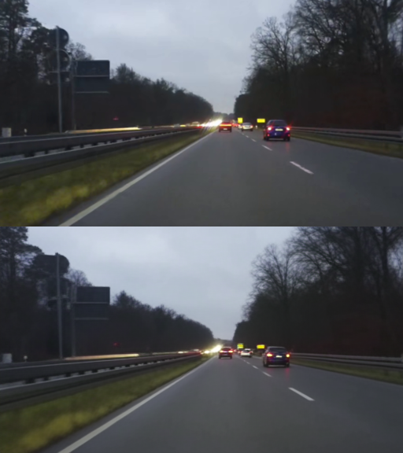

# Driving_Simulator
This project explores world models for autonomous driving, inspired by Wayve’s GAIA-1. A world model learns to represent and predict driving environments from video, enabling agents to “imagine” future states without explicit physics simulation. This repository implements a modular PyTorch framework for training and evaluating such models.

# Features
* **Image Tokenizer**
    * Compresses and discretizes images
    * Uses *finite scalar quantization*
    * Trained on $L_1$, Perceptual and GAN loss
    * Example (Top: original image, Bottom: reconstruction using 16 x 16 spatial compression)
    

* **Latent Dynamics Transformer**
    * Uses a vanilla transformer model and cross-entropy loss
    * Acts in the latent space of the discrete image tokenizer
    * Predicts image tokens conditioned on previous frames

## Usage

### Setup conda environment

```console
$ conda env create -f environment.yml
$ conda activate driving_simulator
```

### Train an image tokenizer (FSQ-VAE)

Run the following command in the terminal:

```console
$ python cli.py train --train_image_root_path ./data/img --config_path ./configs/vqgan_driving_f16_16384_medium.yaml
```

To see all possible arguments for the training command run

```console
$ python cli.py train -h
```

### Monitor a training run on a server

1. On the **server**:

```console
tensorboard --logdir <logs-path> --port 6006
```

2. Forward the port on the **client** via SSH:

```console
 ssh -L 16006:localhost:6006 <user>@<server-ip>
```

Now you should be able to open the *TensorBoard* dashboard in the browser at `http://127.0.0.1:16006`.

# Project structure

```
├── configs/        # YAML configs for model training
├── data/           # Example images
├── tokenizer/
|  ├── data/        # datasets
|  ├── engine/      # training engine (minimal Pytorch Lightning)
|  ├── models/      # trainable models
|  └── modules/     # model components (not standalone trainable)
├── cli.py          # Training entrypoint
└── environment.yml # Conda environment
```

## References

[1] van den Oord, A., Li, Y., & Vinyals, O. (2017). "Neural discrete representation learning".

[2] Esser, P., Rombach, R., & Ommer, B. (2021). "Taming Transformers for High-Resolution Image Synthesis".

[3] Zhang, R., Isola, P., Efros, A. A., Shechtman, E., & Wang, O. (2018). "The Unreasonable Effectiveness of Deep Features as a Perceptual Metric".

[4] Hu, A., Russell, L., Yeo, H., Murez, Z., Fedoseev, G., Kendall, A., Shotton, J., & Corrado, G. (2023). "GAIA-1: A Generative World Model for Autonomous Driving".
