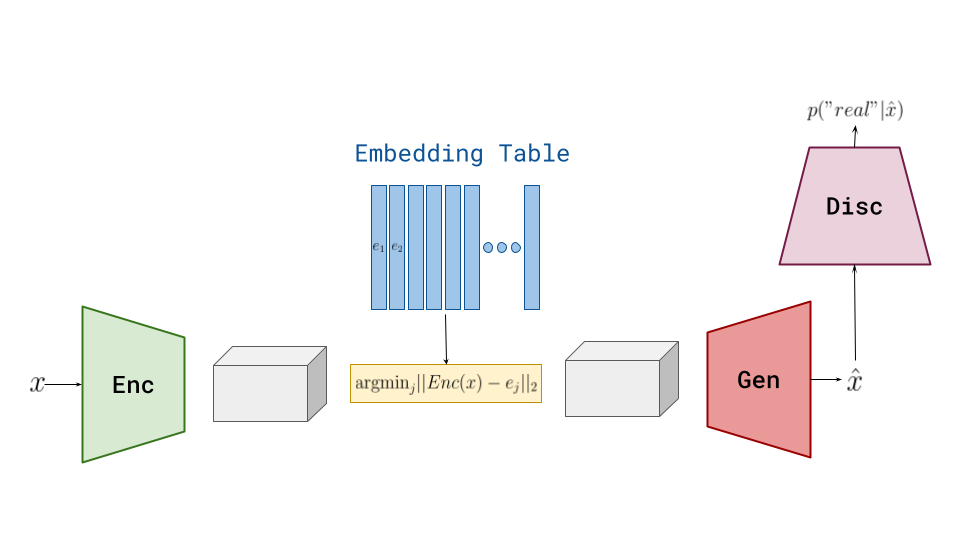

# Driving_Simulator
A PyTorch based training framework for a Machine Learning Driving Simulator like the GAIA-1 [4]. Currently only a VQ-GAN image tokenizer is implemented. A transformer-based, action-conditioned world model will follow soon.



## Getting started

### Setup conda environment

```console
$ conda env create -f environment.yml
```

### Train the model

Run the following commands in the terminal:

```console
$ conda activate driving_simulator
$ cd VQ_VAE
$ python train.py
```

## Implemented features

### VQ-VAE

* VQ-VAE with exponential moving average embedding update from [1]
* GAN loss [2]
* LPIPS perceptual loss [3]
* $K$-means initialization on first mini-batch
* $l_2$-normalization / cosine-similarity in distance calculation

## Performance baseline

| Architecture | codebook dim. | codebook size | # Training samples | $\beta$ | Learning rate | Weight decay | Epochs | Batch size | Test reconstruction loss (L2) |
|----|----|----|----|----|----|----|----|-----|-----|
|<ul><li>4 Conv2d w/ 4x4 kernel</li><li>2 Residual Blocks</li></ul>| 16 | 2048 | 95475 | 0.25 | $2e^{-4}$ | $0.01$ | 50 | 15 | 0.0060 |

## References

[1] van den Oord, A., Li, Y., & Vinyals, O. (2017). "Neural discrete representation learning".

[2] Esser, P., Rombach, R., & Ommer, B. (2021). "Taming Transformers for High-Resolution Image Synthesis".

[3] Zhang, R., Isola, P., Efros, A. A., Shechtman, E., & Wang, O. (2018). "The Unreasonable Effectiveness of Deep Features as a Perceptual Metric".

[4] Hu, A., Russell, L., Yeo, H., Murez, Z., Fedoseev, G., Kendall, A., Shotton, J., & Corrado, G. (2023). "GAIA-1: A Generative World Model for Autonomous Driving".
